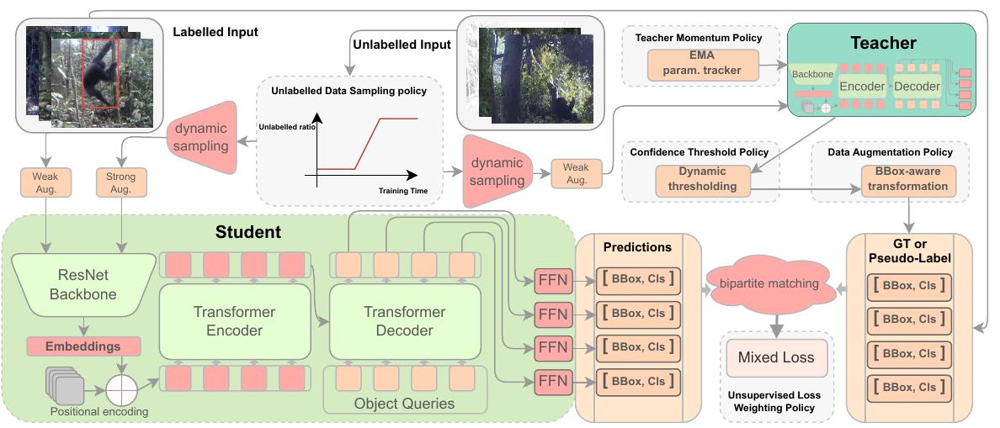

# Dynamic Curriculum Learning for Great Ape Detection in the Wild
### [Xinyu Yang](https://youshyee.xyz/), [Tilo Burghart](http://people.cs.bris.ac.uk/~burghard/), [Majid Mirmehdi](http://people.cs.bris.ac.uk/~majid//)



This repository is the official implementation of paper [Dynamic Curriculum Learning for Great Ape Detection in the Wild](https://arxiv.org/abs/2205.00275).

<!-- ## abstract -->
<!--  -->
<!--     We propose a novel end-to-end curriculum learning approach that leverages large volumes of unlabelled great ape camera trap footage to improve supervised species detector construction in challenging real-world jungle environments. In contrast to previous semi-supervised methods, our approach gradually improves detection quality by steering training towards virtuous self-reinforcement. To achieve this, we propose integrating pseudo-labelling with dynamic curriculum learning policies. We show that such dynamics and controls can avoid learning collapse and gradually tie detector adjustments to higher model quality. We provide theoretical arguments and ablations, and confirm significant performance improvements against various state-of-the-art systems when evaluating on the Extended PanAfrican Dataset holding several thousand camera trap videos of great apes. We note that system performance is strongest for smaller labelled ratios, which are common in ecological applications. Our approach, although designed with wildlife data in mind, also shows competitive benchmarks for generic object detection in the MS-COCO dataset, indicating wider applicability of introduced concepts. -->

## Installation

### Requirements

* Linux, CUDA>=9.2, GCC>=5.4

* Python>=3.7

### Install Dependencies

1. create a conda environment:

```bash
conda create -n DCLNet python=3.7 pip
```

2. activate the environment:

```bash
conda activate DCLNet
```

3. Installation pytorch follow the official doc install at [here](https://pytorch.org/)

```bash
conda install pytorch==1.8.0 torchvision==0.9.0 cudatoolkit=10.2 -c pytorch
```

4. Installation other packages

```bash
pip install -r requirements.txt
```

5. Install CUDA extension

```bash
cd ./models/ops
sh ./make.sh
```

6. test your CUDA extension

```
python test.py
```

### Test Environments

    CPU: AMD EPYC 7543 (128) @ 2.794GHz
    GPU: NVIDIA GRID A100X
    OS: CentOS Linux release 7.9.2009 (Core) x86_64
    nvcc version: 11.2
    GCC version: 7.5.0
    python version: 3.7.11

## Usage

### Dataset preparation

#### MSCoco
Please download [COCO 2017 dataset](https://cocodataset.org/) and organize it in the following structure:
```
data/
└── coco
    ├── test2017
    ├── train2017
    ├── val2017
    └── annotations
        ├── instances_train2017.json
        ├── instances_val2017.json
        └── semi_supervised
            ├── instances_train2017.1@10.json
            ├── instances_train2017.1@10-unlabeled.json
            ├── instances_train2017.1@1.json
            ├── instances_train2017.1@1-unlabeled.json
            ├── instances_train2017.1@5.json
            ├── instances_train2017.1@5-unlabeled.json
            ├── instances_train2017.2@10.json
            ├── instances_train2017.2@10-unlabeled.json
            ├── instances_train2017.2@1.json
            ├── instances_train2017.2@1-unlabeled.json
            ├── instances_train2017.2@5.json
            ├── instances_train2017.2@5-unlabeled.json
            ├── instances_train2017.3@10.json
            ├── instances_train2017.3@10-unlabeled.json
            ├── instances_train2017.3@1.json
            ├── instances_train2017.3@1-unlabeled.json
            ├── instances_train2017.3@5.json
            ├── instances_train2017.3@5-unlabeled.json
            ├── instances_train2017.4@10.json
            ├── instances_train2017.4@10-unlabeled.json
            ├── instances_train2017.4@1.json
            ├── instances_train2017.4@1-unlabeled.json
            ├── instances_train2017.4@5.json
            ├── instances_train2017.4@5-unlabeled.json
            ├── instances_train2017.5@10.json
            ├── instances_train2017.5@10-unlabeled.json
            ├── instances_train2017.5@1.json
            ├── instances_train2017.5@1-unlabeled.json
            ├── instances_train2017.5@5.json
            └── instances_train2017.5@5-unlabeled.json
```
The partial labelled data (PLD) are split by:
```bash
cd ./datasets/prepare_coco
sh ./run.sh
```
#### PanAfrican
Coming soon! Stay tuned !

### Semi-supervised Mix-training
#### COCO training
1. running with 1% PLD at fold1 (4 high-end GPUs required):
```bash
sh ./train_coco_1percent_1fold.sh
```
2. running with 5% PLD at fold1 (4 high-end GPUs required):
```bash
sh ./train_coco_5percent_1fold.sh
```
2. running with 10% PLD at fold1 (4 high-end GPUs required):
```bash
sh ./train_coco_10percent_1fold.sh
```
#### PanAfrican training
Coming soon! Stay tuned

###  Models checkpoints

| Setting | Dataset    | mAP   | mAP50 | map75 | checkpoint(Student and Teacher) |
|---------|------------|-------|-------|-------|---------------------------------|
| 1% PLD  | COCO       | 17.34 | 31.00 | 17.35 | xx                              |
| 5% PLD  | COCO       | 29.75 | 46.68 | 31.77 | xx                              |
| 10% PLD | COCO       | 34.45 | 51.93 | 37.14 | xx                              |
| 10% PLD | PanAfrican | 45.96 | 78.10 | 47.67 | coming soon                     |
| 20% PLD | PanAfrican | 59.01 | 89.23 | 66.95 | coming soon                     |
| 50% PLD | PanAfrican | 63.39 | 92.96 | 70.00 | coming soon                     |


## Citation
If you are considering using this codebase, please cite our work:

```bibtext
@misc{yang2021dcldet,
      title={Dynamic Curriculum Learning for Great Ape Detection in the Wild},
      author={Xinyu Yang and Tilo Burghart and Majid Mirmehid},
      year={2022},
      eprint={2205.00275},
      archivePrefix={arXiv},
      primaryClass={cs.CV}
}
```

## Credits
This repository builds on previous works codebase 1. [Deformable DETR](https://github.com/fundamentalvision/Deformable-DETR) 2. [DETReg](https://github.com/amirbar/DETReg).
Please consider citing these works as well.

